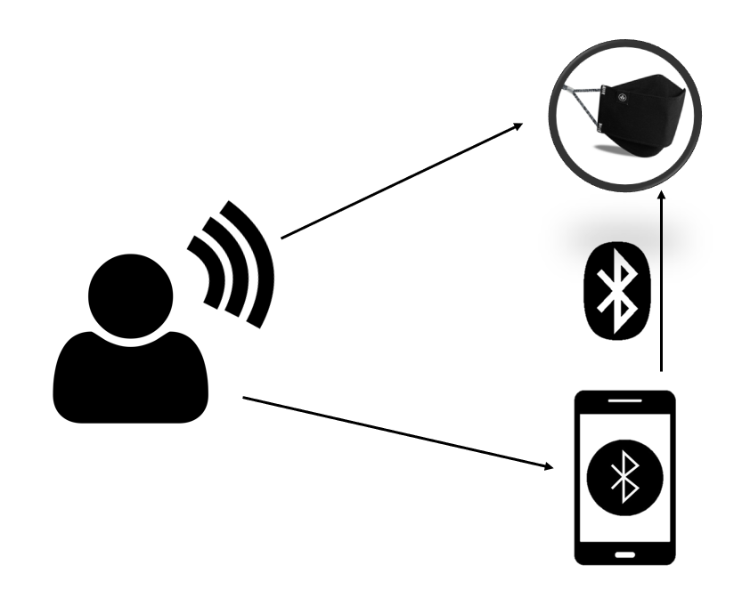
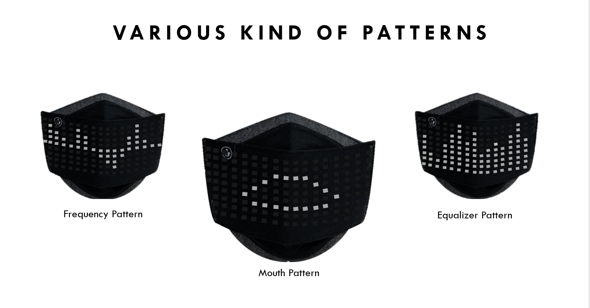
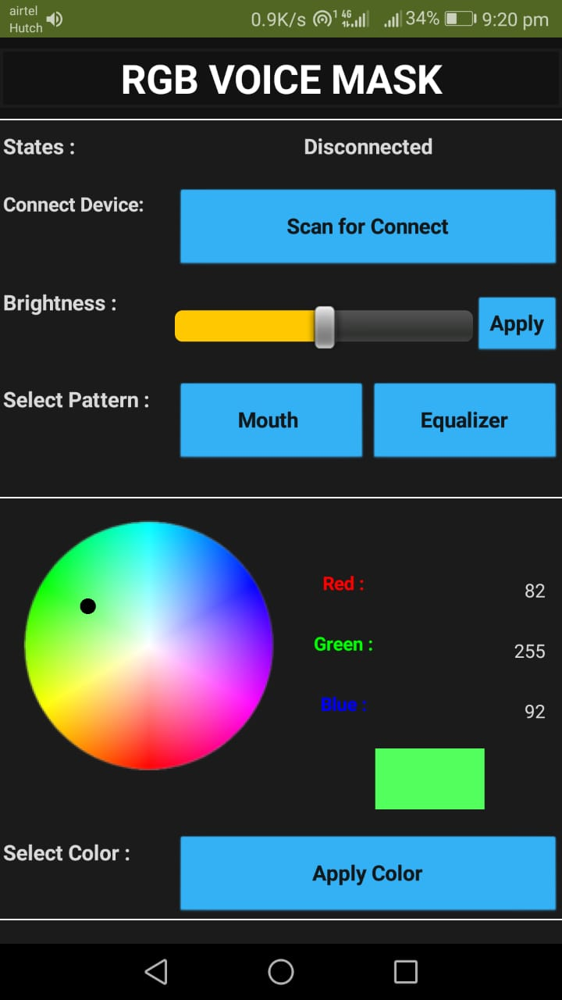

## About the Project

This is a Responsive LED mask that can generate various patterns according to the gain and frequency of the voice. And there is a mobile app that changes different patterns, Colors, and Brightness of the LEDs of the mask.

#### simple diagram

## Demo

this is a sample demo

## Features

- Change Patterns
- Change Brightness
- Change Colors
- Save previous settings
- Rechargeable

## Patterns

1. Mouth Pattern
2. Equalizer pattern
3. Frequency pattern (under development)

## UI

## How to setup :

#### Setup Android app:
1. Go to the MIT App Inventor website. [Link here](https://appinventor.mit.edu/)
2. Go to "Create Apps!".
3. Sign in with your Google account.
4. Go to Projects > Import project from my computer > Choose File 
5. Then select LEDMaskApp.aia file and open.
6. Then select "OK".
7. Give any name to the project > OK.
8.  Now you can change the app as you want.
9. Finally go to the build > "Android App"  to build the app.

#### Setup the LED mask Circuit.

##### What you need
1. Arduino Nano board.
2. MAX9814 Microphone sensor
3. WS2812b Addressable 60LED/M RGB LED Pixel Strip
4. HC-05 Bluetooth adapter
5. 5V Battery
6. LED Strip
7. 5V boost lithium battery charging protection board 134N3P

## Diagram

Diagram will be added soon.
